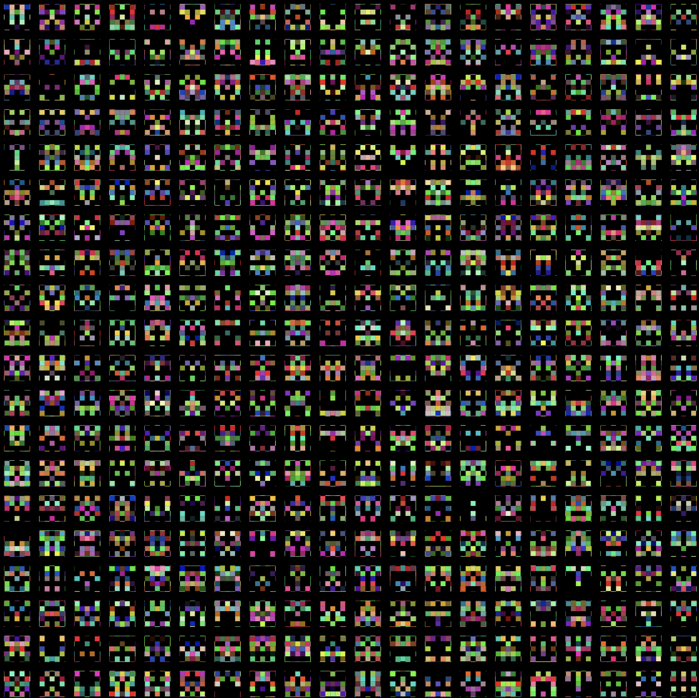

# Generative-Art-Gallery
<h5> Check out the gallery: <a href="https://thegalleryofcomputation.herokuapp.com/" target="_blank">The Gallery of Computation</a>
<h2>What is Generative Art?</h2>

Generative art refers to art that in whole or in part has been created with the use of an autonomous system. An autonomous system in this context is generally one that is non-human and can independently determine features of an artwork that would otherwise require decisions made directly by the artist. In some cases the human creator may claim that the generative system represents their own artistic idea, and in others that the system takes on the role of the creator.

A book on Generative Art that I love: <a href="https://www.goodreads.com/book/show/9840982-generative-art">Generative Art: A Practical Guide Using Processing</a>

<h2>Some Generative Art I created </h2>
<h4>Amalgamations</h4>
<ul>
   <h5>Homage to tennis</h5>
   
   <h5>Recursive Trees and Gaussian Noise for paint effect</h5>
  
  <h5>Perlin Noise with tuned Noise Factor leading to swirls</h5>
  
  <h5>Kandinsky Inspired</h5>
  
  <h5>Lorentz System</h5>
  
  <h5> NN </h5>
  
  <h5>i. Quad Trees(Buildings) with Pi Numbers(Moon) and background Perlin Noise(Wind Effect)</h5>
  
  
  <h5>ii. Tiling + De Jong(IFS)</h5>
  
  
  <h5>iii. Circles</h5>  
  <h6>Pastel Texture</h6>
  
  <h5>iv. Eye(?) </h5>
  
  <h5>v. Spirals </h5>
  

    
    
  

  <h5>vi. Circle Packing </h5>
   
  <h5>vi. Flow Fields </h5>
  
  
  <h5>vii. Experiments with Rectangles and Gaussian Noise </h5>
  

  
  
  

  
  <h5> vii. Lorentz Attractor System</h5>
  
</ul>

<h4>1. L-System Trees</h4>
<ul>
  
</ul>
<h4>2. Perlin Noise</h4>
<ul>
  
  
</ul>

<h4>3. Cellular Automata</h4>
<ul>
  <h5>i. Spiral Automata and Neighbour Automata</h5>
  

    
    
  

  <h5>ii. Water Ripples (Neighbour Automata)</h5>
  

    
  

</ul>
<h4>4. Tiling</h4>
<ul>
  
</ul>
<h4>5. Iterative Function System (IFS) </h4>
<ul>
  <h5>De Jong IFS</h5>
  
</ul>
<h4>6. Flocking Simulations </h4>
<ul>
  <h5>Craig Reynolds Algo</h5>
  

    
    
  

  
</ul>
<h4>7. Genetic Algorithms </h4>
<ul>
  <h5>Trails of "Smart Rockets"</h5>
  

    
    
  

</ul>

<h2>TODO</h2>
<ol>
  <li>Create the gallery page</li>
  <li>Create individual pages for separate techniques</li>
  <li>Start with the framing of each Art</li>
  <li>Convert to dynamic galleries and show the simulations whenever possible over static images of the art</li>
</ol>
